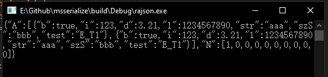
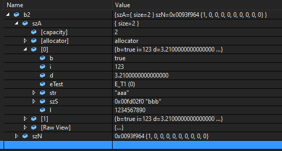

# msserialization序列化框架

参考Boost的archive编写的序列化框架：
能够较为容易的序列化/反序列化复杂的数据结构（不限于扁平数据）。

特点：
1. 小巧、纯头文件、C++模板实现，无需编译。
2. 用非侵入式设计，原有数据结构无需修改。
3. 序列化、反序列化只需要一套代码。
4. 数据结构成员发生添加或删除时，不影响其其他数据成员。
5. 可序列化常用数据类型（如字符串、bool等）、数组、容器、嵌套自定义类型。
6. 可序列化指针、智能指针。
7. 可序列化指向子类的基类指针、智能指针（需要额外编写基类到子类的适配器）。
8. 可序列化枚举类型（转为可视的字符串，需要提供枚举值和字符串对应关系）。

以Rapidjson+STL作为示例，代码如下：

假如需要序列化的数据结构定义如下：

```C++
enum EnumTest { E_T2, E_T2, E_T3 };

class A
{
public:
    bool b;
    int i;
    double d;
    EnumTest eTest;
    std::string str;
    char szS[10];
    long long l;
};

class B
{
public:
    std::vector<A> szA;
    int szN[10] = { 0 };
};
```

使用者需要编写的自定义数据结构的序列化代码如下：

```C++
const char* szEnumTest[] = { "E_T1", "E_T2", "E_T3" };

template<class Ar>
void ex_serialize(Ar& ar, A& tValue)
{
    ar.io("b", tValue.b);
    ar.io("i", tValue.i);
    ar.io("d", tValue.d);
    ar.io("l", tValue.l);
    ar.io("str", tValue.str);
    ar.io("szS", tValue.szS);
    ar.io("test", MSRPC::EnumApt<EnumTest>(tValue.eTest, szEnumTest));
}

template<class Ar>
void ex_serialize(Ar& ar, B& tValue)
{
    ar.io("A", tValue.szA);
    ar.io("N", tValue.szN);
}
```

序列化输出代码：
```C++
int main()
{
	//赋值
	A a;
	a.i = 123;
	a.d = 3.21;
	a.str = "aaa";
	a.l = 1234567890;
	strcpy(a.szS, "bbb");
	a.eTest = E_T1;

	B b;
	b.szA.push_back(a);
	b.szA.push_back(a);
	b.szN[0] = 1;

	//序列化
	std::string strBuf = MSRPC::ToJsonS(b);
	std::cout << strBuf.c_str() << std::endl;

	return 0;
}
```

输出结果：



反序列化代码：

```C++
//反序列化
B b2;
MSRPC::FromJsonS(b2, strBuf);

std::cout << b2.szA.size() << " " << b2.szA[0].str << std::endl;
```

输出结果：



因为序列化和反序列化均使用ex_serialize模板函数，所以只需编写一次序列化代码，就能自动完成序列化和反序列化功能，也正是因为如此，不用担心序列化反序列化不匹配导致解析出错。

另外只有自定义数据结构（如上文的class A和B）才需要编写ex_serialize模板函数，像数组、容器、指针，框架会自动类型推导，不需要使用者编写额外代码。
